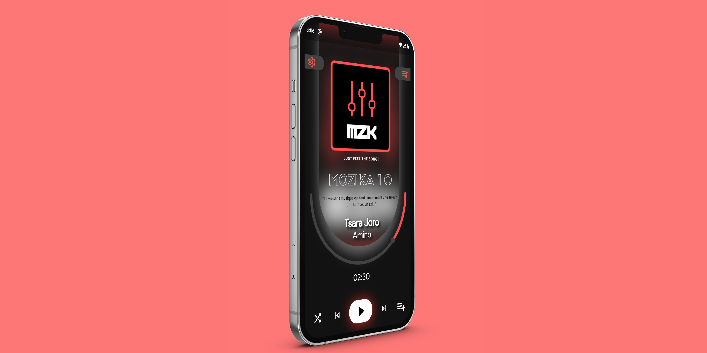

# MOZIKA (mozika)

Lecteur musique pour android, stylé et simpliste

## Pages
- Page de lecture
- Page pour la liste des tracks
- Page pour les paramètres
- Page de recherche
## Techenologies et langages

Développement:

<h2>
-Flutter 

-Dart 
</h2>
<h3>
Design:

-Photoshop

-CANVA

